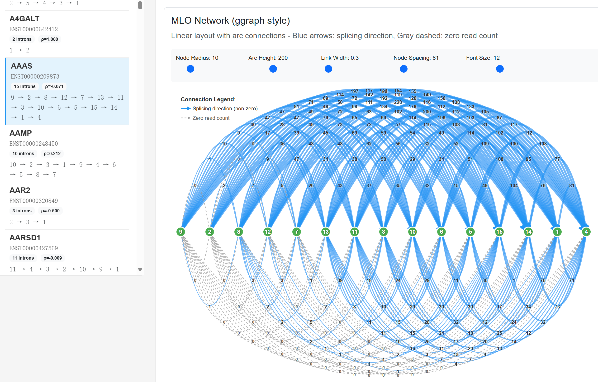
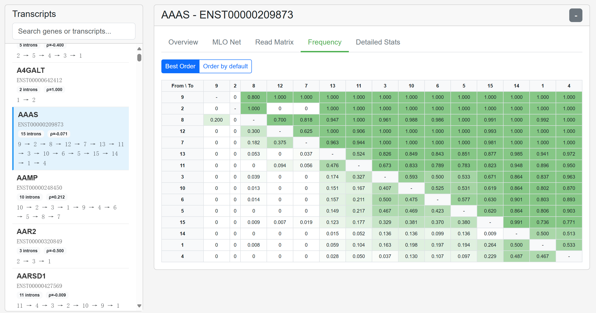

# intronOrder - Intron Splicing Order Analysis R Package

An R package for analyzing intron splicing order using Integer Linear Programming (ILP) algorithms. This package processes RNA-seq data to determine the most likely splicing order of introns within transcripts.

## Features

-   **Complete analysis pipeline**: From BAM files to comprehensive reports
-   **ILP-based algorithms**: Find most likely splicing orders using optimization methods
-   **Interactive visualizations**: Generate HTML reports with interactive MLO networks

## Installation

### From GitHub (Development Version)

``` r

#install.packages("Rsymphony", repos = "<https://cran.r-project.org>") 
#options(BioC_mirror="<https://mirrors.westlake.edu.cn/bioconductor>") 
BiocManager::install("lpSolve") 
# Install the package from GitHub 
devtools::install_github("limeng12/intronOrder")
```

### Dependencies

The package has the following dependencies which will be installed automatically:

``` r
options(BioC_mirror = "https://mirrors.westlake.edu.cn/bioconductor")
options(repos = c(CRAN = "https://mirrors.westlake.edu.cn/CRAN/"))

# CRAN
install.packages(c("devtools", "Rcpp", "plyr", "dplyr", "igraph", "stringr", 
                   "dbscan", "ggplot2", "ggraph", "tidygraph", "reshape2", 
                   "gridExtra", "data.table", "plotly", "DT", "jsonlite", 
                   "htmltools", "scales", "testthat", "knitr", "rmarkdown", "readr"))

# Bioconductor
if (!require("BiocManager")) install.packages("BiocManager")
BiocManager::install(c("GenomicAlignments", "Rsamtools", "GenomicRanges", "BiocStyle"))


```

## Quick Start

### Basic Usage Example

``` r

conda create -n r_iso -c conda-forge -c bioconda \
r-base=4.4 r-devtools \
r-rcpp r-plyr r-dplyr r-igraph r-stringr r-dbscan \
r-ggplot2 r-ggraph r-tidygraph r-reshape2 r-gridextra \
r-data.table r-plotly r-dt r-jsonlite r-htmltools \
r-scales r-testthat r-knitr r-rmarkdown r-readr \
bioconductor-genomicalignments bioconductor-rsamtools \
bioconductor-genomicranges bioconductor-biocstyle -y


#install.packages("Rsymphony", repos = "<https://cran.r-project.org>") 
#options(BioC_mirror="<https://mirrors.westlake.edu.cn/bioconductor>") 
BiocManager::install("lpSolve") 
# Install the package from GitHub 
devtools::install_github("limeng12/intronOrder")


# Load the package
library(intronOrder)
#library(Rsymphony)
library(lpSolve)

# Get example data paths from package. Bam file and 12 columns bed files
bedfile <- system.file("extdata", 
                      "Schizosaccharomyces_pombe.ASM294v2.43.chr_nothick.bed", 
                      package = "intronOrder")
bamfile <- system.file("extdata", 
                      "SRR6144325_junction_only.bam", 
                      package = "intronOrder")
#idmap <- system.file("extdata", "pombe_ensembl_gene_id_trans_id_map.tsv", package = "intronOrder")

# Step 1: Generate intron splicing order data from BAM
iso_results <- getIsoFromBam(
  bed_file = bedfile,
  bam_file = bamfile,
  output_file = "example_iso.tsv"
)

# Step 2: Run complete analysis pipeline
results <- run_iso_analysis(
  bed_file = bedfile,
  iso_files = c("example_iso.tsv"),
  output_file = "results.tsv",
  read_cov_threshold = 0.95,
  alpha = 0.1
)

# Step 3: Generate reports and visualizations
igraph_list <- results$key_re_list

# Interactive HTML report
generate_splicing_order_report(
  igraph_list,
  output_file = "results.splicing_order_report.html"
)

# PDF visualizations
#draw_mlo_plot(igraph_list, "results.plot.pdf")
#draw_mol_table_plot(igraph_list, "results.table.pdf")
```




## Analysis Pipeline

The package provides a comprehensive workflow:

### 1. Data Preparation (`getIsoFromBam`)

-   Input: BED annotation file + BAM alignment file
-   Output: Intron splicing order pairs (iso_file)

### 2. Main Analysis (`run_iso_analysis`)

-   **Intron extraction**: Parse BED file for exon/intron positions
-   **Isoform building**: Construct adjacency matrices from splicing data
-   **Order calculation**: Use ILP algorithms to find most likely order
-   **Statistical analysis**: Calculate entropy, correlation, p-values
-   **Heterogeneity**: Measure splicing pattern variability

### 3. Visualization (`generate_splicing_order_report`)

-   **Interactive HTML report**: Browse transcripts, view MLO networks

## Output Files

After running the pipeline, you'll get:

1.  **Tabular results** (`results.tsv`): Main analysis results
2.  **HTML report** (`*.splicing_order_report.html`): Interactive visualization
3.  **PDF plots** (`*.plot.pdf`): MLO network visualizations
4.  **Table plots** (`*.table.pdf`): Probability matrices

## Advanced Usage

### Customizing Analysis Parameters

### Working with Large Datasets

``` r
# Process multiple BAM files
bam_files <- c("sample1.bam", "sample2.bam", "sample3.bam")
iso_files <- c()

for (i in seq_along(bam_files)) {
  iso_file <- paste0("sample", i, "_iso.tsv")
  getIsoFromBam(
    bed_file = "annotation.bed",
    bam_file = bam_files[i],
    output_file = iso_file,
    n_threads = 4  # Use multiple threads
  )
  iso_files <- c(iso_files, iso_file)
}

# Combine and analyze
results <- run_iso_analysis(
  bed_file = "annotation.bed",
  iso_files = iso_files,
  output_file = "combined_results.tsv"
)
```

## Functions Overview

### Core Functions

-   `run_iso_analysis()`: Main analysis pipeline
-   `getIsoFromBam()`: Generate iso_file from BAM
-   `calculate_most_likely_order()`: ILP-based order calculation

### Visualization Functions

-   `generate_splicing_order_report()`: Interactive HTML report
-   `draw_mlo_plot()`: MLO network PDF plots
-   `draw_mol_table_plot()`: Probability matrix PDF plots

## Input File Formats

### BED File Requirements

-   Standard 12-column BED format without thick
-   Must contain exon block information (columns 10-12)
-   Transcript IDs should be unique

### Gene-Transcript Mapping File (Optional)

```         
gene_id transcript_id   gene_symbol
ENSG000001  transcript1 GeneA
ENSG000002  transcript2 GeneB
```

### Iso File Format (Output from `getIsoFromBam`)

```         
transcript_id   left_intron right_junction  strand  cover_count junction_count
```

## Troubleshooting

### Common Issues

1.  **"No valid transcripts found"**
    -   Check BED file format and chromosome naming
2.  **"No reads in BAM file for transcript"**
    -   Verify BAM file has reads in transcript regions
    -   Check alignment quality and MAPQ scores

## Citation

If you use intronOrder in your research, please cite:

```         
Li, M. (2020). Calculating the most likely intron splicing orders in S. pombe, fruit fly, Arabidopsis thaliana, and humans. 
```

## Support

For issues, feature requests, or questions: - Create an issue on GitHub - Check the documentation: `?intronOrder` - See function help: `?run_iso_analysis`

## License

MIT License - see LICENSE file for details. \`
